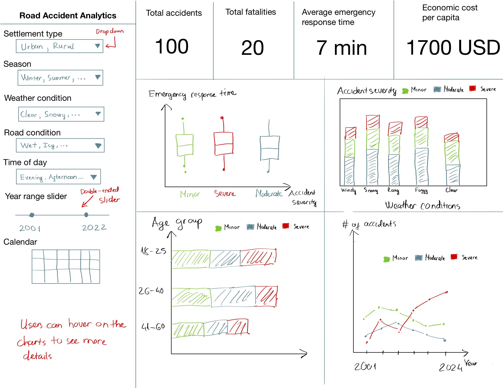

# Proposal

## Motivation and Purpose

Our role: Data analysts specializing in transportation safety being hired by the Canadian government

Target audience: Canadian government transportation agencies and urban planners

Road accidents are a major public safety concern, leading to significant loss of life, economic costs, and infrastructural damage. Understanding the factors contributing to accidents—such as weather conditions, vehicle types, and driver behaviors—can help policymakers and city planners design safer road systems. To address this issue, we propose building an interactive dashboard that allows stakeholders to explore Canadian road accident trends, analyze accident severity across different regions, and identify key risk factors. By providing visual insights and filtering capabilities, our dashboard will help decision-makers implement targeted interventions to improve road safety.

## Description of the data

TO BE FILLED BY FRANKLIN

MENTION THAT THE DATA IS COMING FROM [link](https://www.kaggle.com/datasets/ankushpanday1/global-road-accidents-dataset)

## Research Questions

- Which weather conditions lead to the most severe accidents?
- Are certain times of day or days of the week more prone to high-severity accidents?
- Do driver factors such as alcohol level, fatigue, or age group correlate with accident severity and fatalities?
- How do geographic differences (urban vs rural) influence accident trends and outcomes?
- Which road conditions, such as icy or wet surfaces, are most frequently associated with severe or fatal outcomes?

In summary, analyzing how weather and road conditions, geographic differences, and driver behaviors contribute to road accidents can guide the strategic allocation of resources to reduce risk and fatalities.

## Usage Scenarios

Daniel’s main goal is to create a policy brief for regional authorities. He hopes to show how accidents in rural areas differ from those in urban centers and needs concrete data to support recommendations for resource allocation and new safety measures.

To achieve this goal, he plans to:

1. Analyze accident trends across both urban and rural areas to compare key differences.

2. Filter for severe accidents in both settings to pinpoint high-risk areas that need attention.

3. Compare driver characteristics, including age, alcohol level, and fatigue, to assess their correlation with accident severity.

4. Examine emergency response times across urban and rural regions to determine if delays contribute to higher fatality rates.

5. Identify patterns that could inform targeted safety measures, such as traffic regulations or infrastructure improvements.

When Daniel logs into the dashboard, he sees an overview of accidents across Canada. To compare `Rural` and `Urban` areas, he selects both categories in the Urban or Rural filter. The dashboard updates with summary statistics, showing a higher frequency of severe accidents in rural regions. To understand contributing factors, he applies additional filters to analyze accidents during commuting hours (`Morning` and `Afternoon`).

Next, Daniel examines weather conditions and notices that rainy weather significantly increases accidents in rural areas during weekday mornings, while urban areas see higher accident rates in congested evening hours. He further filters the data for `Rainy` conditions and discovers that rural accidents often occur on roads with speed limits over 80 km/h and poor visibility, with driver fatigue and alcohol use as recurring factors.

Equipped with these insights, Daniel drafts a policy recommendation that includes installing weather-warning signboards on high-speed rural highways, increasing law enforcement presence during identified high-risk hours, and developing designated rest stops on long routes to reduce fatigue-related accidents. He also presents findings on emergency response delays in rural areas, proposing improved resource distribution to reduce fatality risks.

This policy brief is shared with authorities, who begin discussions on implementing these recommendations. Additionally, Daniel suggests a follow-up study focused on the impact of road infrastructure on accident severity, as early insights indicate that road quality and maintenance may also play a critical role in accident preventions.

## App sketch & brief description

TO BE FILLED BY TIEN
